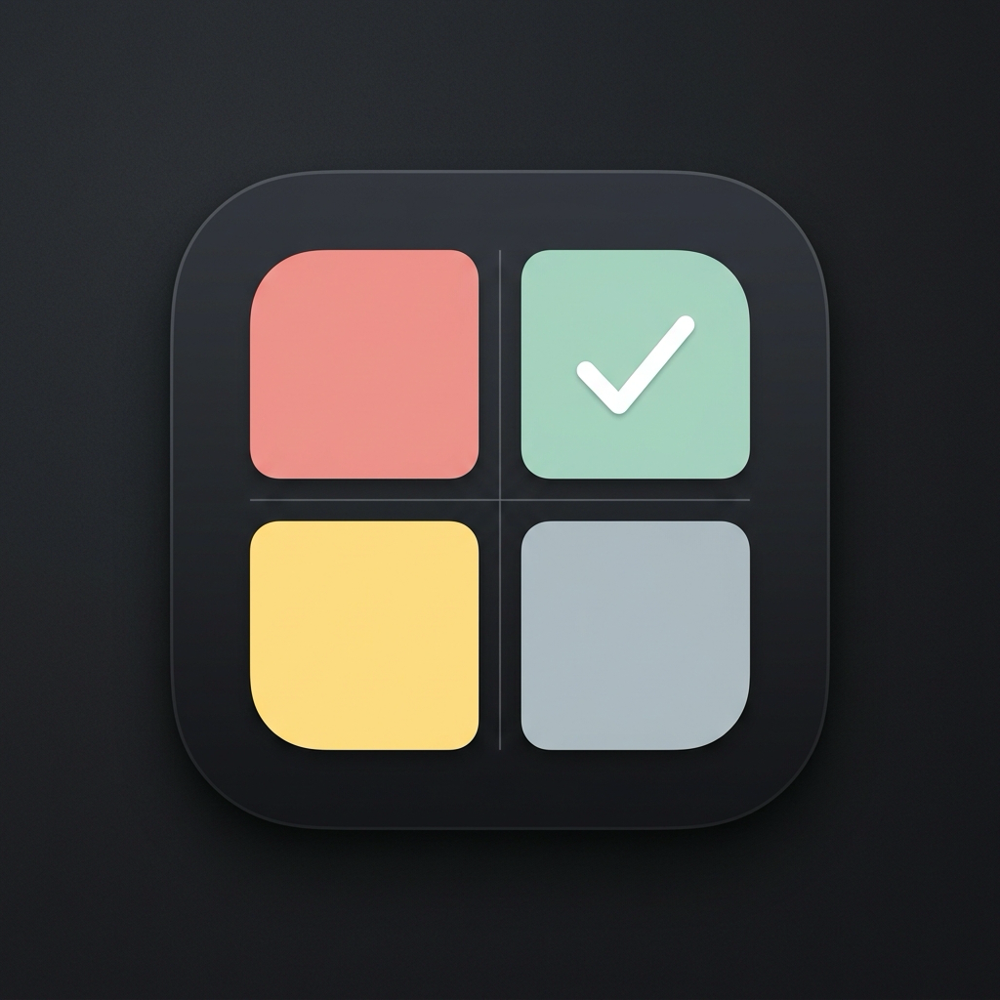

# 🚀 아이젠하워 투두 (Eisenhower Todo & Workout Tracker)

<p align="center">
  
</p>

<p align="center">
  <b>우선순위 기반의 스마트한 할 일 관리와 매일의 오운완(Workout) 습관 형성의 완벽한 결합</b>
</p>

<p align="center">
  
  
  
  
  
</p>

---

## 💡 Overview

**아이젠하워 투두**는 드와이트 D. 아이젠하워의 **'시간 관리 매트릭스(4분면 원칙)'**와 **투두메이트(Todo Mate)** 감성의 직관적인 카테고리/캘린더 뷰, 그리고 현대인의 필수 루틴인 **오운완(Workout) 트래커**를 하나로 통합한 올인원 생산성 & 라이프스타일 애플리케이션입니다.

모바일(iOS, Android)과 데스크톱(macOS) 간 실시간 클라우드 동기화와 홈 화면 위젯을 완벽 지원합니다.

---

## ✨ Key Features

### 1. 🎯 아이젠하워 매트릭스 (4분면 우선순위 관리)
중요도와 긴급도를 기준으로 할 일을 체계적으로 분류하여 뇌의 인지 부하를 줄이고 핵심 목표에 집중합니다.
- **Q1 (긴급하고 중요한 일)**: 마감 직전 업무, 위기 대응 등 즉각 실행
- **Q2 (긴급하지 않지만 중요한 일)**: 자기계발, 독서, 중장기 계획 (인생의 성장을 만드는 영역)
- **Q3 (긴급하지만 중요하지 않은 일)**: 단순 미팅, 부탁받은 잡무 등 신속 처리
- **Q4 (긴급하지도 중요하지도 않은 일)**: SNS 서핑, 단순 시간 낭비 요소
- 🔥 **Q4 인시너레이터 (소각로)**: 7일 이상 방치된 Q4 태스크 자동 소각 정리 기능 탑재

### 2. 🗓️ 투두메이트 스타일의 일별 타임라인 뷰
- **감성적인 카테고리 관리**: 나만의 이모지와 컬러 팔레트로 카테고리 자유 구성 및 드래그 앤 드롭 순서 변경
- **날짜 스트립 & 월간 캘린더**: 날짜별 달성 현황(완료 도장)을 한눈에 파악
- **루틴(반복) 지원**: 매일, 평일, 주말, 요일별 반복 태스크 자동 인스턴스화

### 3. 🏋️‍♂️ 오운완 (Workout & Habit Tracker)
- **일자별 독립 관리 (Default Clean)**: 하루의 시작은 빈 상태에서 산뜻하게 출발하며, 그날 계획한 운동만 등록하고 기록
- **정밀 세트 트래킹**: 세트별 무게(kg), 횟수(reps), 완료 토글, 운동 시간(분), 심플 체크 등 맞춤 기록
- **운동 프리셋 (Preset) 시스템**: 자주 하는 운동 루틴을 프리셋으로 저장하여 원터치로 당일 운동 목록에 즉시 불러오기
- **연속 운동 스트릭 (🔥 Streak)**: 매일의 운동 달성을 카운트하는 동기부여 스트릭
- **주간/월간 통계 & 전용 캘린더**: 이번 주 운동 볼륨 및 잔여 운동 현황을 그래프와 캘린더로 시각화

### 4. 📱 홈 화면 위젯 (iOS WidgetKit & Android AppWidget)
- 앱을 열지 않아도 홈 화면에서 실시간 4분면 잔여 과제, 최우선 실행 태스크, 오늘의 오운완 달성률 및 연속 스트릭 확인
- Apple SwiftUI 기반 WidgetKit 및 Android RemoteViews 연동

### 5. ☁️ 실시간 클라우드 동기화 & 소셜 로그인
- **오프라인 우선 (Offline-First)**: SQLite 로컬 DB 기반으로 네트워크가 없는 환경에서도 즉각 반응
- **Firebase Firestore 실시간 스트림**: 데이터 변경 시 모바일과 맥앱 간 실시간 양방향 자동 동기화
- **간편한 소셜 로그인**: Google 로그인 및 Apple로 로그인(Sign in with Apple) 완벽 지원

### 6. 🎨 세련된 UI & 다크 모드
- 직관적인 글래스모피즘 스타일과 현대적인 타이포그래피
- 시스템 설정에 유연하게 반응하는 완벽한 라이트 / 다크 테마 지원

---

## 🛠️ Tech Stack & Architecture

### Client
| 영역 | 기술 스택 | 설명 |
| :--- | :--- | :--- |
| **Framework** | Flutter (3.44+) | 크로스 플랫폼 프레임워크 |
| **Language** | Dart (3.12+) | 널 세이프티 및 최신 패턴 매칭 |
| **State Management** | Provider | 반응형 상태 관리 및 비즈니스 로직 분리 |
| **Local Database** | SQLite (`sqflite`, `sqflite_common_ffi`) | 모바일 & 데스크톱 로컬 영속화 |
| **Home Widgets** | `home_widget`, SwiftUI (iOS), Kotlin (Android) | 네이티브 홈 화면 위젯 연동 |
| **Notifications** | `flutter_local_notifications`, `timezone` | 마감 기한 및 루틴 알림 스케줄링 |

### Cloud & Backend
| 영역 | 기술 스택 | 설명 |
| :--- | :--- | :--- |
| **Authentication** | Firebase Auth | Google / Apple 소셜 로그인 |
| **Database** | Cloud Firestore | NoSQL 실시간 멀티 디바이스 동기화 |

---

## 📂 Project Structure

```bash
lib/
├── firebase_options.dart         # Firebase 플랫폼별 환경 설정
├── main.dart                     # 앱 엔트리포인트 및 테마 초기화
├── models/                       # 데이터 모델
│   ├── category_model.dart       # 투두 카테고리 (이모지, 컬러, 순서)
│   ├── routine_model.dart        # 반복 루틴 규칙 모델
│   ├── todo_model.dart           # 할 일 모델 (우선순위 4분면, 날짜, 마감)
│   └── workout_model.dart        # 운동 및 세트 디테일, 프리셋, 운동 로그
├── providers/
│   └── todo_provider.dart        # 전역 상태 관리 및 비즈니스 로직 (DB & Sync 오케스트레이션)
├── screens/
│   ├── home_screen.dart          # 메인 홈 화면 (탭 전환, 네비게이션)
│   └── trash_screen.dart         # 휴지통 및 복구 관리 화면
├── services/
│   ├── auth_service.dart         # Google / Apple 소셜 인증 서비스
│   ├── database_helper.dart      # SQLite 스키마, 쿼리, 마이그레이션 (v10)
│   ├── notification_service.dart # 로컬 푸시 알림 서비스
│   ├── sync_service.dart         # Firestore 실시간 양방향 동기화 서비스
│   └── widget_service.dart       # iOS/Android 홈 위젯 데이터 브릿지
├── theme/
│   └── app_theme.dart            # 컬러 팔레트, 글래스모피즘, 다크/라이트 테마
└── widgets/                      # 재사용 가능한 UI 컴포넌트
    ├── add_task_sheet.dart       # 할 일 추가/수정 바텀시트
    ├── add_workout_sheet.dart    # 운동 및 세트 입력/프리셋 저장 시트
    ├── category_manage_dialog.dart # 카테고리 관리/순서 변경 다이얼로그
    ├── date_strip_header.dart    # 상단 일별 날짜 선택 스트립
    ├── routine_manage_dialog.dart# 루틴 목록 및 관리 다이얼로그
    ├── unified_dashboard_widget.dart # 상단 스마트 대시보드 위젯
    ├── weekly_workout_stats_dialog.dart # 주간 운동 통계 팝업
    ├── workout_calendar_dialog.dart # 운동 전용 캘린더 다이얼로그
    └── workout_view.dart         # 오운완 메인 뷰 컴포넌트
```

---

## 🚀 Getting Started

### 1. 사전 요구사항 (Prerequisites)
- [Flutter SDK](https://docs.flutter.dev/get-started/install) (`>= 3.44.0`)
- [Dart SDK](https://dart.dev/get-dart) (`>= 3.12.0`)
- Xcode 15+ (macOS 및 iOS 빌드 시)
- Android Studio / Android SDK 34+ (Android 빌드 시)

### 2. 설치 및 패키지 가져오기
```bash
# 레포지토리 클론
git clone https://github.com/meisteryi/Todo_Eisenhower.git
cd Todo_Eisenhower

# 의존성 패키지 다운로드
flutter pub get
```

### 3. Firebase 설정
프로젝트 루트에 `firebase.json` 및 각 플랫폼별 설정 파일을 구성합니다:
- Android: `android/app/google-services.json`
- iOS: `ios/Runner/GoogleService-Info.plist`
- macOS: `macos/Runner/GoogleService-Info.plist`

### 4. 로컬 실행
```bash
# 연결된 기기 확인
flutter devices

# 실행 (디버그 모드)
flutter run
```

---

## 📦 Build & Release

릴리즈 산출물은 `Release_Builds/` 디렉토리에 플랫폼별로 패키징되어 있습니다:

```bash
# 1. macOS 릴리즈 앱 빌드
flutter build macos --release

# 2. Android 릴리즈 APK 빌드
flutter build apk --release

# 3. iOS 릴리즈 IPA (사이도로딩/Archive) 빌드
flutter build ipa --release --no-codesign
```

| 플랫폼 | 산출물 위치 | 설명 |
| :--- | :--- | :--- |
| **macOS** | `Release_Builds/Todo_Eisenhower_macOS.zip` | macOS 배포용 패키지 (.app 포함) |
| **Android** | `Release_Builds/Todo_Eisenhower.apk` | 안드로이드 설치용 APK |
| **iOS** | `Release_Builds/todo_eisenhower.ipa` | 사이드로딩/재서명용 iOS IPA |

---

## 📄 License

This project is licensed under the MIT License - see the [LICENSE](LICENSE) file for details.
